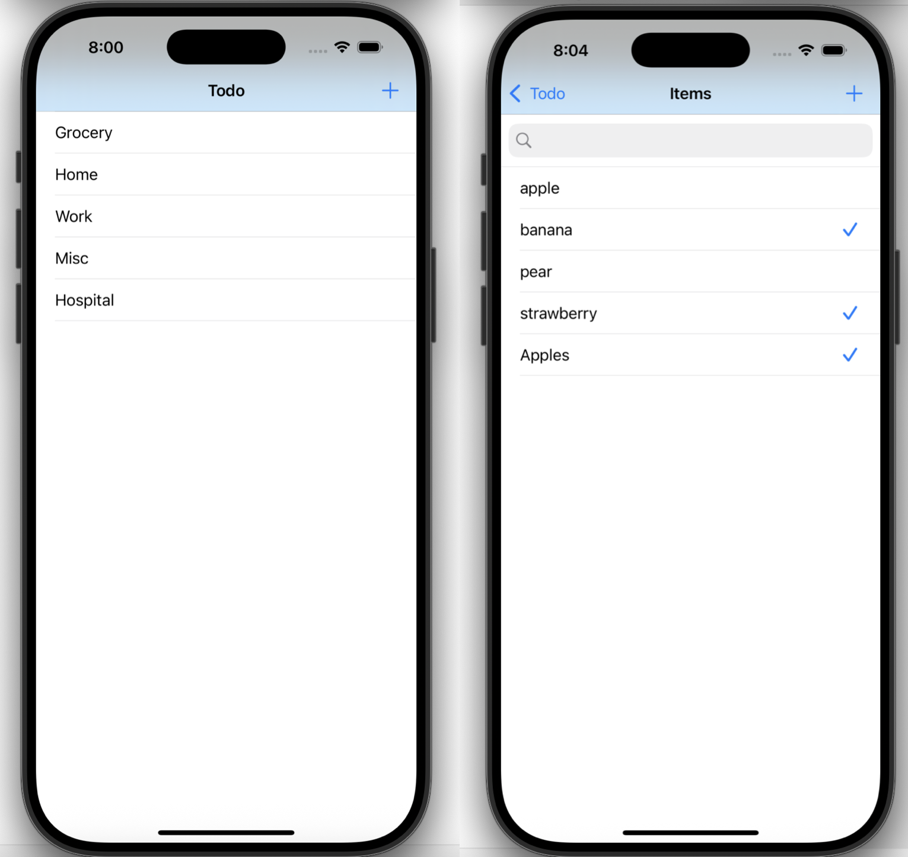

# ✅ Todo - iOS App
A clean and simple Todo app built using **UIKit** and **Core Data**, allowing users to create multiple categories and items under each category. Supports adding, marking, and searching todo items.

---
## Preview 
 
---

## 📱 Features

- Add custom **categories** and organize tasks within them
- Add and remove **todo items**
- Mark tasks as complete/incomplete with a **checkmark**
- **Search functionality** to filter items in a selected category
- **Persistent storage** using Core Data
- Custom alerts for adding new tasks and categories
- Navigation between views using segues and `UITableViewController`

---

## 🧱 Tech Stack

- **Language**: Swift
- **UI Framework**: UIKit
- **Persistence**: Core Data
- **Components**:
  - `UITableView`
  - `UIAlertController`
  - `UISearchBar`
  - `NavigationController`

---

## 🧠 Core Data Model

- **Category**
  - `name: String`
  - `relationship ->> Item (one-to-many)`
  
- **Item**
  - `title: String`
  - `done: Bool`
  - `parentCategory: Category` (many-to-one)

---

